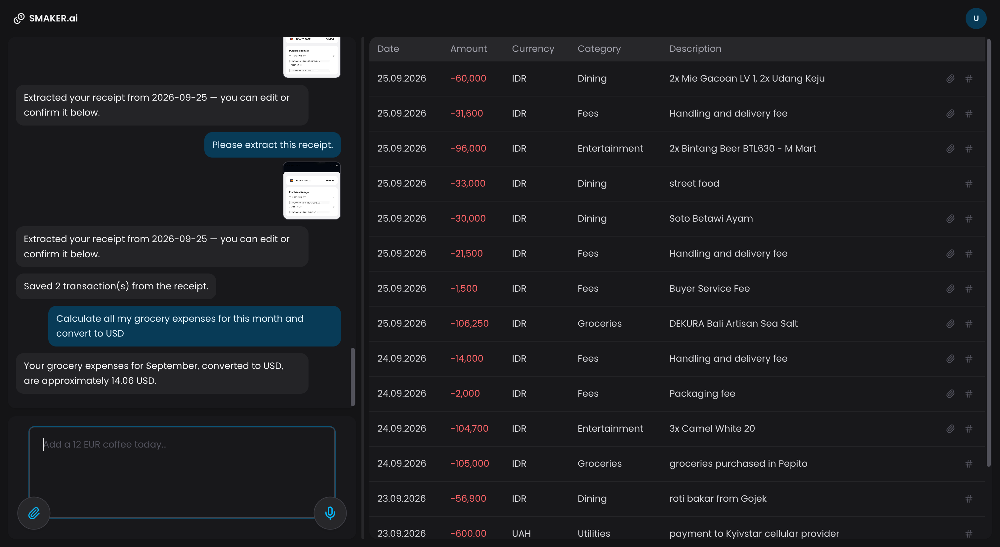

# SMAKER.ai — bookkeeping chat

A B2C bookkeeping app: a chat pane driven by a LangGraph agent sits next to a
transactions table. Two independent FastAPI services front two Postgres databases; a
local Docker Compose stack stands in for every GCP piece the design targets (Firebase
Auth/Firestore, Cloud Storage, Cloud Tasks, Cloud Run, Hosting rewrites), so the only
thing that talks to the real internet is the LLM provider's API (OpenAI by default —
see "Swapping the LLM provider") and a free public exchange-rate lookup.

⭐ If you find this project useful, please consider giving it a star ⭐ — it helps a lot!



## Quickstart

1. `cp .env.example .env` and set `LLM_API_KEY` (an OpenAI key).
2. `mkdir -p gcs/receipts-local`
3. `docker compose up --build` (or `docker-compose up --build` on the standalone CLI).
4. Open `http://localhost:8080` and sign in — the Auth emulator shows a fake Google
   account picker; add any test account, no real Google account needed.
5. Reset everything with `docker compose down -v` (also drops the Postgres volume).

**First boot is slow to become responsive (15–30s):** the `agent` container imports the
full LangGraph/LangChain/LangSmith stack at startup, and `firebase-tools`
downloads the Firestore emulator JAR on first run. Watch `docker compose logs -f` for
"Uvicorn running" (both FastAPI services) and "All emulators ready" (Firebase).

Useful side doors while it's running:
- `http://localhost:4000` — Firebase Emulator UI (inspect signed-in users/tokens)
- `localhost:5432` — Postgres (`owner`/`owner_pw`, databases `bookkeeping` and `chat`)

Two of the four app containers (`agent`, `transactions`) bake their code into the
image at build time — editing their source requires `docker compose up -d --build
<service>` to take effect, a plain `restart` won't pick it up. `web` bind-mounts
`./web` and runs Vite's dev server, so frontend edits hot-reload immediately.

Each of `services/agent`/`services/transactions` has two Dockerfiles:
`Dockerfile.dev` is what `docker-compose.yml` builds (matches this section — full
`uv sync` including dev tools, hardcoded port 8000 matching the `Caddyfile`'s
internal routing); `Dockerfile` is the lean, multi-stage production image
`.github/workflows/{agent,transactions}.yml` build and deploy to Cloud Run (no dev
tools, non-root user, listens on Cloud Run's injected `$PORT` instead of a
hardcoded one — see "Deploying to GCP" below).

## Code quality tooling

Each Python service is its own independent [`uv`](https://docs.astral.sh/uv/) project
(own `pyproject.toml` + `uv.lock`, no shared config across services) with `black`,
`isort`, `mypy`, and `pytest` (+ `pytest-asyncio`) as dev dependencies (the
`dependency-groups.dev` group, installed automatically by `uv sync`), run via
[`poethepoet`](https://github.com/nat-n/poethepoet) tasks:

```bash
cd services/agent   # or services/transactions
uv sync              # only needed for local (non-Docker) use
uv run poe start         # run the service (what the Dockerfile's CMD uses)
uv run poe format        # black + isort, writes
uv run poe format:check  # same, check-only
uv run poe lint          # mypy
uv run poe test          # pytest
uv run poe check         # format:check + lint + test, in one go
```

`format`/`format:check`/`lint` also run inside the already-built containers (e.g.
`docker compose exec agent uv run poe lint`), since `app/` is baked into the image.
`test`/`check` need the local (non-Docker) `uv sync` above instead — `tests/` is
deliberately not copied into the runtime image.

Each service's `tests/` directory covers its business logic (money/idempotency/
categorization, context assembly, tool HTTP calls, quotas, pagination, etc.) with
mocked DB connections and HTTP transports — no live Postgres or network access needed
to run them — plus a handful of endpoint-level tests via FastAPI's `TestClient`,
covering both success and error paths (400/401/404/409/429/501 as appropriate).

The frontend uses [`pnpm`](https://pnpm.io/) plus ESLint (flat config,
`typescript-eslint` + React Hooks/Refresh plugins), Prettier, and
[Vitest](https://vitest.dev/) + React Testing Library:

```bash
cd web
pnpm install
pnpm run lint           # eslint .
pnpm run format          # prettier --write .
pnpm run format:check    # prettier --check .
pnpm run test            # vitest run
pnpm run test:watch      # vitest, watch mode
```

`pnpm-workspace.yaml`'s `allowBuilds`/`onlyBuiltDependencies` approve the three
packages here with native postinstall scripts (`esbuild`, `@firebase/util`,
`protobufjs`) — pnpm blocks arbitrary install scripts by default as a supply-chain
guard; everything else installs with no scripts run at all.

Tests run in `jsdom` with no real network/DOM: pure logic (`src/lib/*.test.ts` — CSV
building, the default filter's rolling date window, translation lookups, the
Firestore cross-tab dedup logic) plus component tests (`src/components/*.test.tsx` —
`@testing-library/react`, mocking `lib/api.ts`/Firebase/`fetch` at the module
boundary rather than hitting a network). `ChatPanel.tsx` and `App.tsx` aren't
covered yet — they'd need SSE/fetch-stream mocking infrastructure that doesn't exist
yet.

## What it does

- **Chat-driven transactions.** Add, edit, delete (one at a time or bulk by filter),
  and query transactions in natural language. The agent resolves a vague reference
  ("that one", "the coffee one") from transactions already touched this conversation,
  or searches the whole table by description text ("the bagel one") when it isn't —
  or, unambiguously, from an explicit `#` reference button on any table row, which
  drops a `[transaction: <id>]` marker into the message box.
- **Directly editable table.** Every column (date via a native date picker, category
  via a dropdown built from the same list the backend categorizer uses, amount,
  currency, description — full text on hover via a tooltip once it's truncated) is
  also editable in place, and each row has its own delete button, gated behind a
  custom confirmation dialog (`ConfirmDialog.tsx`, styled to match the rest of the
  app) since deleting is irreversible — chat isn't the only way to change a
  transaction, just the natural-language one.
- **Analysis.** "How much did I spend on dining last month?" always calls a real
  aggregates endpoint — the model is instructed to never state a number from memory
  or from the conversation summary.
- **Filtering.** "Show USD expenses over 100 from last month" drives the table's
  filter directly; the table has no filter controls of its own, everything routes
  through chat.
- **CSV export.** "Export this view" builds a CSV client-side from the table's current
  filter and drops it into the chat as a clickable file attachment.
- **Voice input.** Record a message with the mic button; it's transcribed
  (Whisper) server-side and dropped into the message box for you to review or edit
  before sending — same as typing it, nothing is sent automatically.
- **Receipts.** Upload a photo or PDF; the configured vision model (`gpt-4o` by
  default — see "Swapping the LLM provider") extracts line items and categorizes each
  one, and the UI shows editable proposed rows — nothing is written until you
  confirm. Rows can be edited, removed, or added before confirming (Confirm & save
  is disabled once the list is empty), and each row's category is a dropdown built
  from the same built-in category list the backend categorizer uses, so it can't
  drift out of sync. There's no separate merchant field: a merchant/place name, when
  identifiable, is folded straight into the item's description. Category corrections
  (made via chat or by editing a proposed row) are learned per normalized description
  and reused on future similar purchases, with an LLM fallback that recognizes
  near-duplicate wording it doesn't match exactly.
- **Exchange rates.** "What's 50 USD in EUR?" calls a free, keyless daily reference
  rate covering 300+ currencies — explicitly a reference rate, never used to silently
  convert or alter a transaction's actual stated
  amount/currency.
- **Live updates.** A same-tab SSE event updates the table instantly; a Firestore
  `sync/{uid}` document signals other open tabs/devices to refetch (each client tags
  its own writes with a client ID so it doesn't re-trigger itself).
- **Chat memory.** Threads persist in Postgres and survive reloads/devices. Once a
  thread's message history exceeds the context window's recent-message budget, the
  overflow folds into a rolling per-thread summary (a background task, off the hot
  path) that records intents/decisions, never specific amounts, since a lossy summary
  must never be trusted for numbers.
- **Localization.** Ten languages — English, Spanish, Indonesian, French, German,
  Portuguese, Hebrew, Russian, Ukrainian, Arabic — selectable per account. Not just UI
  strings: the chat model is instructed to reply in the selected language regardless
  of what language the user types in, receipt line items get translated into it, the
  category column's built-in labels are translated for display (the stored/matched
  value stays the English key), and Hebrew/Arabic flip the whole layout to RTL via
  logical CSS properties (not just a `dir` attribute flip).
- **Dark/light theme**, persisted locally, no flash of the wrong theme on reload.
- Per-user daily quotas (chat turns, receipts, tokens — configurable via
  `DAILY_TURN_LIMIT`/`DAILY_RECEIPT_LIMIT`) and optional LangSmith tracing; it
  activates purely from environment variables, so an empty `.env` still runs the full
  app with tracing simply never turning on.

## Architecture at a glance

```
Browser ── Caddy (:8080) ──┬── /api/chat/*         → agent (FastAPI + LangGraph, SSE)
                            ├── /api/transactions/* → transactions (FastAPI)
                            ├── /gcs/*              → fake-gcs (receipt storage)
                            └── / (everything else) → web (Vite dev server + HMR)

agent ──HTTP, forwards caller's own JWT──► transactions ──► Postgres "bookkeeping" (RLS)
agent ──asyncpg───────────────────────────────────────────► Postgres "chat" (RLS)
agent ──LLM provider (chat + vision)──► primary model, with a fallback model on failure
agent ──Firebase Auth emulator──► verify_id_token (never skipped, even locally)
agent ──Firestore emulator──► sync/{uid} live-update signal
agent ──currency-api (jsdelivr CDN)──► exchange-rate lookups (no key, free)
```

The agent never impersonates a user: every call it makes to the transactions service
forwards the caller's own verified JWT, so Postgres row-level security
(`current_setting('app.uid')`) is the real isolation boundary, not application code —
the agent has no elevated identity of its own.

### Backend — two independent FastAPI services, each owning its own Postgres database

- **`services/transactions`** — the system of record.
  - `routers/transactions/` — keyset-paginated `GET /transactions` (`list.py`), batch
    `POST /transactions` (`create.py`), `PATCH /transactions/{id}` (`patch.py`,
    includes rescaling `amount_minor` if just the currency changes), single and
    filtered-bulk `DELETE` (`delete.py` — the bulk one exists because the agent's
    per-id delete loop only ever saw one page of results, so "delete all my
    transactions" was silently deleting just the first 50), and `serializers.py`
    (row → API JSON shape).
  - `routers/aggregates.py` — sums by currency/category/month, same filter set as the
    list endpoint.
  - `filters.py` — the filter-clause builder shared by `list.py`, `delete.py`, and
    `aggregates.py` (currency/category/type/date range/amount range/description →
    SQL `WHERE` clause), so the three don't drift out of sync with each other.
  - `categorize.py` — corrections-first, LLM-fallback categorization, keyed on the
    normalized transaction description (no merchant field).
  - `money.py` — amounts are stored as integer minor units (`amount_minor`), scaled
    by each currency's ISO 4217 exponent (most currencies 2 decimals, some 0 or 3),
    so aggregation never touches floating point.
  - `idempotency.py` — every mutating endpoint requires an `Idempotency-Key` header;
    the same key with the same request body replays the stored response, a different
    body gets a 409.
  - `models/` — Pydantic request/response models, organized by domain
    (`transactions.py`, `aggregates.py`, `categorize.py`, `api.py`) — every FastAPI
    endpoint validates through one of these via `response_model=` rather than
    returning a plain dict.
- **`services/agent`** — a LangGraph `StateGraph` (not `langgraph.prebuilt`'s agent,
  so the emitted SSE event shape is fully controlled): a `call_model` node bound to
  the tools below, conditionally routed to a `ToolNode`, looping back until the model
  stops calling tools. No checkpointer — the graph runs once per HTTP request and
  history lives in the chat DB, not graph state.
  - `llm.py` — a primary model with a one-shot fallback to a secondary model on
    failure/timeout, a 60s overall call timeout, and an in-process concurrency cap.
  - `context/` — token-budgeted prompt assembly: `prompts.py` (the system prompt),
    `tokens.py` (token counting/budget constants), `messages.py` (turn grouping +
    per-row rendering), and `__init__.py`'s `build_context()` (preferences, working
    set, rolling summary, then as many recent turns as fit the budget, newest-first,
    never splitting a tool call from its result).
  - `chat/` — `streaming.py` runs one graph turn via `astream_events` and translates
    it into the SSE wire format; `turns.py` decides whether a `[transaction: <id>]`
    marker turn actually called the tool it claimed to, records a fallback assistant
    message when a turn fails outright (so the thread never ends up with an
    unanswered user message poisoning the next turn's context), and persists a
    completed turn (assistant message, tool results, working set, quota,
    summarization trigger).
  - `tools/` — see the table below; `crud.py`/`currency.py`/`utility.py`/
    `receipts.py` each build one group of tools, `prompts.py` holds the
    receipt-extraction vision prompt, `__init__.py`'s `build_tools()` composes all of
    them per-request.
  - `quotas.py` / `summarize.py` / `tasks.py` — daily usage limits, the rolling
    summary job, and the in-process stand-in for Cloud Tasks (`TASKS_MODE=local`).
  - `models/` — Pydantic models by domain (`turns.py` — per-turn state shared
    between `chat/streaming.py` and `chat/turns.py`; `message_content.py` — the
    `messages.content` DB column's shape, by role; `api.py` — FastAPI request/
    response bodies; `tool_results.py` — every tool's return shape). Every LangChain
    tool constructs one of these and calls `.model_dump()` right before returning,
    rather than building a raw dict inline.

### Agent tools

| Tool | Purpose |
|---|---|
| `add_transaction` | Add an expense or income. No category argument — the transactions service categorizes it. |
| `edit_transaction` | Edit fields on an existing transaction by id. Resolves an explicit `[transaction: <id>]` marker with priority. |
| `delete_transaction` | Delete one transaction by id. |
| `delete_transactions_matching` | Delete every transaction matching a filter (or all of them) in one server-side operation. |
| `query_transactions` | List or (`aggregate=true`) sum transactions matching a filter, including a description substring search. |
| `get_exchange_rate` | Daily reference rate between two currencies, for the user's reference only. |
| `get_total_in_currency` | Sum transactions (optionally filtered) and convert the result into one target currency — the multiply-and-sum happens in code, never left to the model to compute in its reply. |
| `set_filter` | Drive the transactions table's filter from chat. |
| `export_transactions` | Signal the UI to build and attach a CSV of the table's current view. |
| `extract_receipt` | Vision-extract line items from an uploaded receipt image/PDF, categorize each, and propose (never write) rows. |

### Frontend
React 19 + Vite 6 + TypeScript. TanStack Query for server cache, invalidated by the
same-tab SSE `table_changed` event or the cross-tab Firestore signal. Tailwind CSS v4
for styling (dark mode via a class toggle + `@custom-variant`, RTL via logical
properties), `lucide-react` for icons, `@microsoft/fetch-event-source` for SSE (plain
`EventSource` can't send an auth header or a POST body).

Key files: `src/lib/i18n.tsx` (translation dictionaries, RTL/`dir` handling,
`useTranslation()`), `src/lib/sync.ts` (the Firestore live-update listener),
`src/components/ChatPanel.tsx` (message list + SSE streaming input, exposes an
imperative `insertReference` handle so the table's `#` button can drop a marker into
the chat input), `src/components/TransactionsTable.tsx` (every column editable
in place — date/category/amount/currency/description — via `lib/api.ts`'s
`patchTransaction`/`deleteTransaction`), `src/components/ConfirmDialog.tsx` (a
styled `window.confirm()` stand-in, used by the delete button above).

### Local infrastructure
- **`firebase/`** — a container running the Auth and Firestore emulators plus the
  Emulator UI (`firebase-tools`), so sign-in and the live-update signal work with zero
  real Google Cloud project.
- **`fake-gcs-server`** — an in-memory GCS-compatible server for receipt storage;
  `services/agent/app/storage.py` returns a signed GCS URL in production or a direct
  local upload URL here, and the frontend can't tell the difference.
- **Caddy** (`Caddyfile`) — reverse proxy in front of everything, same routing shape
  as the production design's Firebase Hosting rewrites, with SSE responses flushed
  immediately instead of buffered.
- **Postgres 16** — two databases (`bookkeeping`, `chat`), each with its own
  least-privilege role and row-level security policy keyed off `app.uid`, created by
  `db/init/001_schema.sql` and `002_chat.sql` on first boot.

## Environment variables (`.env`)

| Variable | Required | Notes |
|---|---|---|
| `LLM_API_KEY` | yes | API key for the selected provider |
| `LLM_PROVIDER` | no | default `openai` — see "Swapping the LLM provider" below |
| `LLM_MODEL` | no | default `gpt-4o` — main chat/tool-calling loop |
| `LLM_FALLBACK_MODEL` | no | default `gpt-4o-mini` |
| `LLM_SUMMARY_MODEL` | no | default `gpt-4o-mini` — rolling chat summary |
| `LLM_VISION_MODEL` | no | default: same as `LLM_MODEL` — receipt image extraction |
| `TRANSCRIBE_MODEL` | no | default `whisper-1` — voice-input transcription |
| `LANGSMITH_TRACING` / `LANGSMITH_API_KEY` / `LANGSMITH_PROJECT` / `LANGSMITH_ENDPOINT` | no | tracing no-ops if unset |

`DAILY_TURN_LIMIT` (default 200) and `DAILY_RECEIPT_LIMIT` (default 50) are also
overridable but aren't in `.env.example` since the defaults are fine for local dev.
Everything else — database URLs, emulator hosts, storage mode — is wired directly in
`docker-compose.yml` and doesn't need to be set by hand.

### Swapping the LLM provider

Every chat model in `services/agent` — the main tool-calling loop, the fallback and
summary models, and the receipt-vision extraction call — is built through a single
factory, `build_chat_model()` in `app/llm.py`, keyed on `LLM_PROVIDER`. There's no
separate code path for receipt vision anymore (it used to go through its own raw
OpenAI client); it goes through the same factory as everything else, just with
`json_mode=True`.

Supported today: `openai` (default), `anthropic`, `google`. Switching is `LLM_PROVIDER`
+ matching `LLM_API_KEY` + a model name that provider recognizes (e.g. `LLM_MODEL=
claude-haiku-4-5` or `LLM_MODEL=gemini-2.5-flash`) — no code change. The receipt-vision
call's multimodal message (`tools/receipts.py`'s `HumanMessage` with an `image_url`
content block) works unchanged across all three; `langchain-anthropic` and
`langchain-google-genai` both translate that OpenAI-shaped block internally. The one
real difference between providers is JSON-only output: OpenAI's `response_format`
json_object mode has no Anthropic equivalent (Claude relies on the prompt asking for
JSON, which it follows reliably), while Gemini has its own native mechanism
(`response_mime_type`) — `_build_anthropic`/`_build_google` in `app/llm.py` handle this
per-provider so call sites don't need to know or care.

To add another provider: write one builder function (importing that provider's
LangChain integration package inside the function, not at module level, so an
uninstalled package only breaks if that provider is actually selected), add it to the
`_PROVIDER_BUILDERS` map, add the package to `pyproject.toml`, and set `LLM_PROVIDER`.

Voice-input transcription (`/api/chat/transcribe`) is the one call site that doesn't
go through `build_chat_model()` — LangChain has no unified speech-to-text model
abstraction the way it does `BaseChatModel`. It's centralized the same way, just with
its own registry: `transcribe_client()` and `_TRANSCRIBE_CLIENT_BUILDERS` in
`app/llm.py`, also keyed on `LLM_PROVIDER`. Adding a provider that supports
transcription means a builder in that registry too.

## Layout

```
db/init/                     Postgres schema + RLS policies (bookkeeping DB, chat DB)
firebase/                    Auth + Firestore emulator container
gcs/receipts-local/          fake-gcs-server's on-disk backing store
services/transactions/       FastAPI — owns Postgres, CRUD, categorization, idempotency
  pyproject.toml / uv.lock own uv project — deps, black/isort/mypy, poe tasks
  app/filters.py                shared filter-clause builder (list/delete/aggregates)
  app/categorize.py             corrections-first, LLM-fallback categorization
  app/money.py                  decimal string <-> integer minor-unit conversion
  app/models/                   Pydantic request/response models, by domain
  app/routers/aggregates.py     sums by currency/category/month
  app/routers/transactions/     list.py, create.py, patch.py, delete.py, serializers.py
services/agent/               FastAPI + LangGraph — owns chat DB, SSE chat, tools
  pyproject.toml / uv.lock own uv project — deps, black/isort/mypy, poe tasks
  app/tools/                    crud.py, currency.py, utility.py, receipts.py,
                                 prompts.py (receipt-extraction prompt), __init__.py's
                                 build_tools()
  app/context/                  prompts.py (system prompt), tokens.py, messages.py,
                                 __init__.py's build_context()
  app/chat/                     streaming.py (runs one graph turn -> SSE), turns.py
                                 (marker-retry decision, failure recording, persisting
                                 a completed turn)
  app/models/                   Pydantic models, by domain (turns, message_content,
                                 api, tool_results)
  app/languages.py              supported chat/receipt-translation languages
  app/graph.py                  the LangGraph StateGraph (model ⇄ tools loop)
web/                          React + Vite + TypeScript — chat pane + transactions table
  eslint.config.js / .prettierrc.json  lint + format config
  src/lib/i18n.tsx               translation dictionaries, RTL handling, useTranslation()
  src/lib/sync.ts                Firestore cross-tab live-update listener
  src/components/                ChatPanel, TransactionsTable, ReceiptModal,
                                  ConfirmDialog, Tooltip, …
Caddyfile                     Reverse proxy — same routing shape as Firebase Hosting rewrites
docker-compose.yml
terraform/                    GCP infrastructure as code — see "Deploying to GCP" below
.github/workflows/             CI/CD, one workflow per service — see "Deploying to GCP" below
firebase.json                  Firebase Hosting config (rewrites to the two Cloud Run
                                services) — distinct from firebase/firebase.json, which
                                is local-emulator-only
```

## Deploying to GCP

`terraform/` provisions the real GCP resources this local stack stands in for: two
Cloud Run services, Cloud SQL (the same `bookkeeping`/`chat` databases), the receipts
bucket, a Cloud Tasks queue, Secret Manager secrets, Artifact Registry, the Firebase
project link + Firestore database + a Web App, and a Workload Identity Federation
setup for CI/CD (no long-lived GCP key stored anywhere). It does *not* cover:
applying the DB schema (`db/init/*.sql` — still a manual/CI migration step against
the instance it creates), Firestore rules content (still `firebase deploy`), or
Firebase Auth's Google sign-in provider (enabled once by hand in the console).
Service-to-service calls (`transactions`'s `POST /categorize`, `agent`'s
`POST /internal/summarize`) are authenticated with real Google-signed OIDC tokens,
not a stub — `service_auth.py` verifies signature, a fixed audience, and the
specific expected caller identity; `tasks.py` and `receipts.py` are the two
minters. `agent`'s own callback URL (where Cloud Tasks POSTs back to) is derived
per-request from the triggering request's `Host` header rather than an env var —
no manual bootstrap step needed, see `terraform/README.md`'s "Service-to-service
auth" for why. See `terraform/README.md` for the full walkthrough.

`.github/workflows/{agent,transactions,web}.yml` — one independent pipeline per
service: a pull request runs checks only (format/lint/test); a push to `main` also
builds and pushes an image to Artifact Registry (agent/transactions) or a
production build artifact (web), but doesn't deploy; pushing a version tag
(`agent-v1.2.3`, `transactions-v1.2.3`, `web-v1.2.3`) builds, pushes, and deploys
that exact build to Cloud Run or Firebase Hosting. One-time setup (copying
Terraform outputs into GitHub repo variables) is in `terraform/README.md`'s
"GitHub Actions setup".

## Known gaps

- `get_exchange_rate` returns a *daily* reference rate, not live tick-by-tick market
  data.
- Production-only concerns not covered by `terraform/` or `.github/workflows/` —
  App Check, an external load balancer beyond Firebase Hosting, an eval gate, Cloud
  Run autoscaling tuning, a GCS backend for Terraform state (still local, see
  `terraform/README.md`) — are intentionally out of scope for now.
