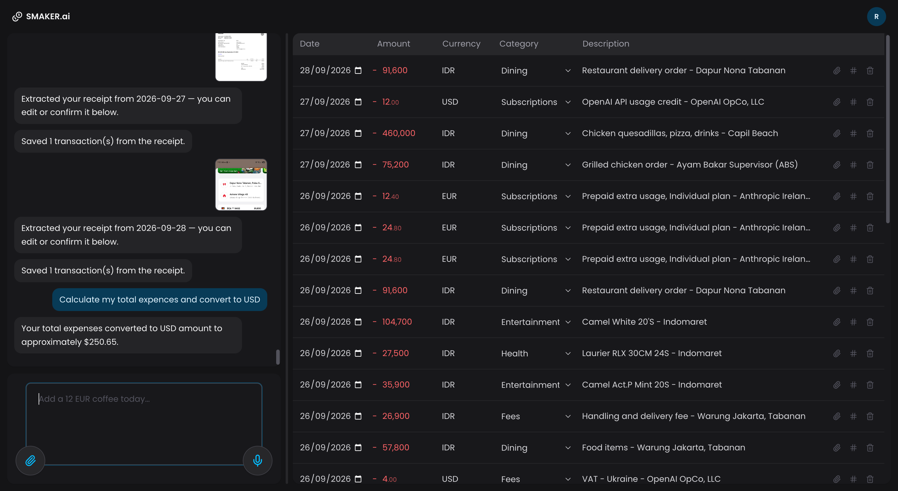

# SMAKER.ai — bookkeeping chat

A B2C bookkeeping app: a chat pane driven by a LangGraph agent sits next to a
transactions table. Two independent FastAPI services front two Postgres databases; a
local Docker Compose stack stands in for every GCP piece the design targets (Firebase
Auth, Cloud Storage, Cloud Tasks, Cloud Run, Hosting rewrites), so the only
thing that talks to the real internet is the LLM provider's API (OpenAI by default —
see "Swapping the LLM provider") and a free public exchange-rate lookup.

⭐ If you find this project useful, please consider giving it a star ⭐ — it helps a lot!



## Quickstart

1. `cp .env.example .env` and set `LLM_API_KEY` (an OpenAI key).
2. `make up` (or `docker compose up --build`).
3. Open `http://localhost:8080` and sign in — the Auth emulator shows a fake Google
   account picker; add any test account, no real Google account needed.
4. `make reset` deletes all local data (database, emulator accounts, receipts) after
   asking for confirmation.

`make` lists every task: `check` (format check, lint and tests for all three
projects), `logs`, `rebuild s=<service>`, `migrate`, `migration db=… name=…`,
`format`, `eval-chat`, `eval-categorize`. Data survives restarts: Postgres in a named
volume, emulator accounts in `firebase/emulator-data/`, receipts in `gcs/`.

**First boot is slow to become responsive (15–30s):** the `agent` container imports the
full LangGraph/LangChain/LangSmith stack at startup, and `firebase-tools` needs a
moment on first run. Watch `docker compose logs -f` for
"Uvicorn running" (both FastAPI services) and "All emulators ready" (Firebase).

Useful side doors while it's running:
- `http://localhost:4000` — Firebase Emulator UI (inspect signed-in users/tokens)
- `localhost:5432` — Postgres (`owner`/`owner_pw`, databases `bookkeeping` and `chat`)

All three app containers hot-reload: `web` bind-mounts `./web` and runs Vite's dev
server; `agent` and `transactions` bind-mount their `app/` folders and run uvicorn with
`--reload` (`uv run poe dev`). Edits take effect within seconds, no rebuild. Only a
dependency change (`pyproject.toml`/`uv.lock`) needs `docker compose up -d --build
--no-deps <service>`.

The Firebase Auth emulator keeps its test accounts in
`firebase/emulator-data/` (gitignored): imported on start, exported when the
container stops, so test users survive restarts and rebuilds. Delete the folder to
start clean.

Both Python services build from one shared `services/Dockerfile`: its `dev` target
is what `docker-compose.yml` uses (every dependency including dev tools, port 8000
matching the `Caddyfile`'s internal routing), and its final stage is the lean
production image CI builds for Cloud Run (no dev tools, non-root user, listens on
Cloud Run's injected `$PORT` — see "Deploying to GCP" below).

## Code quality tooling

Each Python service is its own independent [`uv`](https://docs.astral.sh/uv/) project
(own `pyproject.toml` + `uv.lock`, no shared config across services) with `black`,
`isort`, `mypy`, and `pytest` (+ `pytest-asyncio`) as dev dependencies (the
`dependency-groups.dev` group, installed automatically by `uv sync`), run via
[`poethepoet`](https://github.com/nat-n/poethepoet) tasks:

```bash
cd services/agent   # or services/transactions
uv sync              # only needed for local (non-Docker) use
uv run poe start         # run the service (what the Dockerfile's CMD uses)
uv run poe format        # black + isort, writes
uv run poe format:check  # same, check-only
uv run poe lint          # mypy
uv run poe test          # pytest
uv run poe check         # format:check + lint + test, in one go
```

`format`/`format:check`/`lint` also run inside the running containers (e.g.
`docker compose exec agent uv run poe lint`), which see the live `app/` folder.
`test`/`check` need the local (non-Docker) `uv sync` above instead — `tests/` is
deliberately not copied into the runtime image.

Each service's `tests/` directory covers its business logic (money/idempotency/
categorization, context assembly, tool HTTP calls, quotas, pagination, etc.) with
mocked DB connections and HTTP transports — no live Postgres or network access needed
to run them — plus a handful of endpoint-level tests via FastAPI's `TestClient`,
covering both success and error paths (400/401/404/409/429/501 as appropriate).
The agent also has a `tests/test_contracts.py` that reads the other side's source file
and fails if a list it keeps a copy of drifts (categories and supported languages vs
the web app, zero-decimal currencies vs the transactions service) — the services share no code on purpose, so this
is what keeps those copies honest. The pull-request workflows also run on changes to
those other files.

The frontend uses [`pnpm`](https://pnpm.io/) plus ESLint (flat config,
`typescript-eslint` + React Hooks/Refresh plugins), Prettier, and
[Vitest](https://vitest.dev/) + React Testing Library:

```bash
cd web
pnpm install
pnpm run lint           # eslint .
pnpm run format          # prettier --write .
pnpm run format:check    # prettier --check .
pnpm run test            # vitest run
pnpm run test:watch      # vitest, watch mode
```

`pnpm-workspace.yaml`'s `allowBuilds`/`onlyBuiltDependencies` approve the three
packages here with native postinstall scripts (`esbuild`, `@firebase/util`,
`protobufjs`) — pnpm blocks arbitrary install scripts by default as a supply-chain
guard; everything else installs with no scripts run at all.

Tests run in `jsdom` with no real network/DOM: pure logic (`src/lib/*.test.ts` — CSV
building, the default filter's rolling date window, translation lookups, receipt
upload preparation) plus component tests (`src/components/*.test.tsx` —
`@testing-library/react`, mocking `lib/api.ts`/Firebase/`fetch` at the module
boundary rather than hitting a network). The chat pane is covered through its parts
— `useChatStream` (SSE events → UI state, with `fetchEventSource` mocked),
`ChatComposer`, `ReceiptProposalCard`, and `lib/chat.ts` — rather than the
`ChatPanel` shell that wires them together; `App.tsx` isn't covered yet.

## What it does

- **Chat-driven transactions.** Add, edit, delete (one at a time or bulk by filter),
  and query transactions in natural language. The agent resolves a vague reference
  ("that one", "the coffee one") from transactions already touched this conversation,
  or searches the whole table by description text ("the bagel one") when it isn't —
  or, unambiguously, from an explicit `#` reference button on any table row, which
  drops a `[transaction: <id>]` marker into the message box. "Today", "yesterday" and
  receipt dates resolve in the user's own timezone: the browser sends it with each
  message and the agent computes the date from its own clock (`app/dates.py`).
- **Directly editable table.** Every column (date via a native date picker, category
  via a dropdown built from the same list the categorizer uses, amount,
  currency, description — full text on hover via a tooltip once it's truncated) is
  also editable in place, and each row has its own delete button, gated behind a
  custom confirmation dialog (`ConfirmDialog.tsx`, styled to match the rest of the
  app) since deleting is irreversible — chat isn't the only way to change a
  transaction, just the natural-language one.
- **Analysis.** "How much did I spend on dining last month?" always calls a real
  aggregates endpoint — the model is instructed to never state a number from memory
  or from the conversation summary.
- **Filtering.** "Show USD expenses over 100 from last month" drives the table's
  filter directly; the table has no filter controls of its own, everything routes
  through chat.
- **CSV export.** "Export this view" builds a CSV client-side from the table's current
  filter and drops it into the chat as a clickable file attachment.
- **Voice input.** Record a message with the mic button; it's transcribed
  server-side (`gpt-4o-mini-transcribe` by default) and dropped into the message box
  for you to review or edit before sending — same as typing it, nothing is sent
  automatically.
- **Receipts.** Upload a photo or PDF; the configured vision model (`gpt-4o` by
  default — see "Swapping the LLM provider") reads the receipt's grand total, date and
  merchant, plus a short summary and the names of the items bought. That becomes ONE
  proposed transaction for the total (per-item price splitting proved unreliable
  across real receipts). Its category is the one most of the items fall into: each
  item name goes through the same categorizer as chat adds, and the majority wins (a tie
  goes to whichever category appears first on the receipt). The UI shows the proposal
  as an editable row (description on its own line; category, amount and currency
  below) — nothing is written until you confirm. The category is a dropdown built
  from the same built-in list the categorizer uses. There's no separate
  merchant field: a merchant name, when identifiable, is folded into the description.
  Text typed with the upload is a note to the receipt reader first ("this was
  yesterday" sets the date), then a follow-up agent confirms the card and answers any
  question in it. A plain upload (no typed text) skips the chat model entirely: the
  reply is a fixed, translated sentence, since the outcome is fully determined. Photos are downscaled in the browser before upload (1600px long side,
  JPEG, phone rotation applied), so that's also what's stored; PDFs upload as-is. All
  of a receipt's items are categorized in a single model call.
  Category corrections (made via chat or by editing a proposed row) are learned per
  normalized description and reused on future similar purchases, with an LLM
  fallback that recognizes near-duplicate wording it doesn't match exactly.
- **Exchange rates.** "What's 50 USD in EUR?" calls a free, keyless daily reference
  rate covering 300+ currencies — explicitly a reference rate, never used to silently
  convert or alter a transaction's actual stated
  amount/currency.
- **Live updates.** The tab you're using updates the table instantly (an SSE event
  from the agent, or its own edit). Other tabs and devices refetch when their window
  regains focus, and every 60 seconds while focused — no separate sync service.
- **Chat memory.** Threads persist in Postgres and survive reloads/devices. The model
  sees a rolling per-thread summary plus the messages it doesn't cover yet: once a
  thread has more than 24 unsummarized messages, everything but the newest ~12 (cut
  at a turn boundary) is folded into the summary by a background task, off the hot
  path. History sent per call is also capped at `LLM_HISTORY_TOKEN_BUDGET` tokens,
  and anything that cap trims is folded into the summary too, so nothing is silently
  forgotten. The summary records intents/decisions, never specific amounts, since a
  lossy summary must never be trusted for numbers.
- **Localization.** Ten languages — English, Spanish, Indonesian, French, German,
  Portuguese, Hebrew, Russian, Ukrainian, Arabic — selectable per account. Not just UI
  strings: the chat model is instructed to reply in the selected language regardless
  of what language the user types in, receipt descriptions get translated into it, the
  category column's built-in labels are translated for display (the stored/matched
  value stays the English key), and Hebrew/Arabic flip the whole layout to RTL via
  logical CSS properties (not just a `dir` attribute flip).
- **Dark/light theme**, persisted locally, no flash of the wrong theme on reload.
- Per-user daily quotas (chat turns, receipts, tokens — configurable via
  `DAILY_TURN_LIMIT`/`DAILY_RECEIPT_LIMIT`) and optional LangSmith tracing; it
  activates purely from environment variables, so an empty `.env` still runs the full
  app with tracing simply never turning on.

## Architecture at a glance

```
Browser ── Caddy (:8080) ──┬── /api/chat/*         → agent (FastAPI + LangGraph, SSE)
                            ├── /api/transactions/* → transactions (FastAPI)
                            ├── /gcs/*              → fake-gcs (receipt storage)
                            └── / (everything else) → web (Vite dev server + HMR)

agent ──HTTP, forwards caller's own JWT──► transactions ──► Postgres "bookkeeping" (RLS)
agent ──asyncpg───────────────────────────────────────────► Postgres "chat" (RLS)
agent ──LLM provider (chat + vision)──► primary model, with a fallback model on failure
agent ──Firebase Auth emulator──► verify_id_token (never skipped, even locally)
agent ──currency-api (jsdelivr CDN)──► exchange-rate lookups (no key, free)
```

The agent never impersonates a user: every call it makes to the transactions service
forwards the caller's own verified JWT, so Postgres row-level security
(`current_setting('app.uid')`) is the real isolation boundary, not application code —
the agent has no elevated identity of its own.

### Backend — two independent FastAPI services, each owning its own Postgres database

- **`services/transactions`** — the system of record.
  - `routers/transactions/` — keyset-paginated `GET /transactions` (`list.py`), batch
    `POST /transactions` (`create.py`), `PATCH /transactions/{id}` (`patch.py`,
    includes rescaling `amount_minor` if just the currency changes), single and
    filtered-bulk `DELETE` (`delete.py` — the bulk one exists because the agent's
    per-id delete loop only ever saw one page of results, so "delete all my
    transactions" was silently deleting just the first 50), and `serializers.py`
    (row → API JSON shape).
  - `routers/aggregates.py` — sums by currency/category/month, same filter set as the
    list endpoint.
  - `filters.py` — the filter-clause builder shared by `list.py`, `delete.py`, and
    `aggregates.py` (currency/category/type/date range/amount range/description →
    SQL `WHERE` clause), so the three don't drift out of sync with each other.
  - `corrections.py` — the user's category corrections, keyed on the normalized
    description (no merchant field): saved when the user changes a category (table
    edit, or a receipt's proposed one), listed via `GET /corrections` for the agent's
    categorizer. This service calls no LLM.
  - `money.py` — amounts are stored as integer minor units (`amount_minor`), scaled
    by each currency's ISO 4217 exponent (most currencies 2 decimals, some 0 or 3),
    so aggregation never touches floating point.
  - `idempotency.py` — every mutating endpoint requires an `Idempotency-Key` header;
    the same key with the same request body replays the stored response, a different
    body gets a 409.
  - `models/` — Pydantic request/response models, organized by domain
    (`transactions.py`, `aggregates.py`, `corrections.py`, `api.py`) — every FastAPI
    endpoint validates through one of these via `response_model=` rather than
    returning a plain dict.
- **`services/agent`** — a multi-agent LangGraph graph, built per request in
  `workflows/` (no checkpointer: it runs once per HTTP request and history lives in
  the chat DB, not graph state; hand-built `StateGraph`s rather than
  `langgraph.prebuilt`, so the emitted SSE event shape is fully controlled):

  ```
  chat (main graph)
  ├─ router ─ an upload? ──► receipt_workflow ── the user typed a note? ──► receipt_followup
  │                            load → read → categorize → propose → report
  └─ otherwise ───────────► assistant (call_model ⇄ tools)
  categorize (shared subgraph): load_corrections → classify
     used by receipt_workflow and by the assistant's add_transaction
  ```

  - `router` — plain code, no model call: routes on whether the turn has an upload.
  - `receipt_workflow` — deterministic: download the image, read it with the vision
    prompt (the user's note, e.g. "this was yesterday", goes into that prompt), run
    the `categorize` subgraph, build the proposal and send the card. It records itself
    in history as an `extract_receipt` tool call, so later turns can refer to it. With
    no note, it also writes a fixed translated reply, so no chat model is called.
  - `receipt_followup` — the assistant, specialized for the turn after a receipt:
    its own instructions (confirm the card, answer the question) and **read-only**
    tools. The receipt is saved only when the user confirms the card. With add/edit/
    delete in reach, the model was seen saving it itself, then "editing" it.
  - `assistant` — the general bookkeeping agent with every tool below.
  - `categorize` — corrections first, then one model call for the rest (`categorize.py`).
  - `llm.py` — a primary model with a one-shot fallback to a secondary model on
    failure/timeout, a 60s overall call timeout, per-purpose output-token caps, and an
    in-process concurrency cap.
  - `workflows/` — `main.py` (router and wiring), `receipt.py`, `categorize.py`,
    `assistant.py` (the model ⇄ tools loop; it also sends the model a compacted tool
    schema, with collapsed docstrings and plain optional params, since the schema is
    resent on every call), `state.py`. The nodes talk to the outside through custom
    events (`ui_event`, `tool_record`, `reply`) that `chat/streaming.py` turns into SSE.
  - `prompts/` — `assistant.py` (the system prompt, plus the receipt follow-up's
    instructions), `receipt.py` (the vision-extraction prompt).
  - `receipts.py` — reading a receipt: image download and downscale, the vision call,
    and parsing into one proposed row.
  - `context/` — prompt assembly: `tokens.py` (token
    counting, `HISTORY_TOKEN_BUDGET`), `messages.py` (turn grouping + per-row
    rendering, older tool results compacted), and `__init__.py`'s `build_context()`
    (preferences, working set, rolling summary, then unsummarized turns newest-first
    within the budget, never splitting a tool call from its result) and
    `first_kept_seq()` (where the kept history starts, so trimmed rows get summarized).
  - `chat/` — `runner.py` runs one chat turn end to end (save the message, build
    context, run the main graph, persist, turn failures into error events), so
    `main.py`'s `/api/chat/chat` is just the HTTP layer; `streaming.py` runs one graph
    turn via `astream_events` and translates it into the SSE wire format;
    `turns.py` decides whether a `[transaction: <id>]` marker turn
    actually called the tool it claimed to, records a fallback assistant message when
    a turn fails outright (so the thread never ends up with an unanswered user message
    poisoning the next turn's context), persists a completed turn (assistant message,
    tool results, working set, quota), and triggers summarization by message count.
  - `tools/` — see the table below; `crud.py`/`currency.py`/`utility.py` each build
    one group of tools, `__init__.py`'s `build_tools()` composes them per request
    (and `MUTATING_TOOLS` names the ones the follow-up agent doesn't get).
  - `quotas.py` / `summarize.py` / `tasks.py` — daily usage limits, the rolling
    summary job, and the in-process stand-in for Cloud Tasks (`TASKS_MODE=local`).
  - `models/` — Pydantic models by domain (`turns.py` — per-turn state shared
    between `chat/streaming.py` and `chat/turns.py`; `message_content.py` — the
    `messages.content` DB column's shape, by role; `api.py` — FastAPI request/
    response bodies; `tool_results.py` — every tool's return shape). Every LangChain
    tool constructs one of these and calls `.model_dump()` right before returning,
    rather than building a raw dict inline.

### Agent tools

| Tool | Purpose |
|---|---|
| `add_transaction` | Add an expense or income. No category argument — it's categorized automatically (corrections first, then the categorizer). |
| `edit_transaction` | Edit fields on an existing transaction by id. Resolves an explicit `[transaction: <id>]` marker with priority. |
| `delete_transaction` | Delete one transaction by id. |
| `delete_transactions_matching` | Delete every transaction matching a filter (or all of them) in one server-side operation. |
| `query_transactions` | List or (`aggregate=true`) sum transactions matching a filter, including a description substring search. |
| `get_exchange_rate` | Daily reference rate between two currencies, for the user's reference only. |
| `get_total_in_currency` | Sum transactions (optionally filtered) and convert the result into one target currency — the multiply-and-sum happens in code, never left to the model to compute in its reply. |
| `set_filter` | Drive the transactions table's filter from chat. |
| `export_transactions` | Signal the UI to build and attach a CSV of the table's current view. |

Receipts aren't a tool: the `receipt_workflow` reads an upload into one proposed (never
written) row, with its total, a summarized description and the majority category of
its items.

### Frontend
React 19 + Vite 6 + TypeScript. TanStack Query for server cache, invalidated by the
SSE `table_changed` event, and refetched on window focus and every 60 s while focused
(how other tabs' and devices' changes show up). Tailwind CSS v4
for styling (dark mode via a class toggle + `@custom-variant`, RTL via logical
properties), `lucide-react` for icons, `@microsoft/fetch-event-source` for SSE (plain
`EventSource` can't send an auth header or a POST body).

Key files: `src/lib/i18n/` (`locales/<lang>.ts` — one file per language, typed
against `en.ts` so a missing key is a compile error; `LanguageProvider`, RTL/`dir`
handling, `useTranslation()`),
`src/components/ChatPanel.tsx` (the chat pane — composes the pieces below, and exposes
an imperative `insertReference` handle so the table's `#` button can drop a marker
into the chat input), `src/lib/useChatStream.ts` (sends a turn and turns its SSE
events into UI state), `src/lib/useThreadMessages.ts` (thread history + paging back),
`src/lib/useVoiceRecorder.ts` (press-and-hold voice input), `src/lib/chat.ts` (chat
message/receipt types and pure helpers), `src/components/ChatComposer.tsx` (message
box with the upload and mic buttons), `src/components/ReceiptProposalCard.tsx` (the
editable receipt proposal), `src/components/TransactionsTable.tsx` (every column editable
in place — date/category/amount/currency/description — via `lib/api.ts`'s
`patchTransaction`/`deleteTransaction`), `src/components/ConfirmDialog.tsx` (a
styled `window.confirm()` stand-in, used by the delete button above).

### Local infrastructure
- **`firebase/`** — a container running the Firebase Auth emulator plus the Emulator
  UI (`firebase-tools`), so sign-in works with zero real Google Cloud project.
- **`fake-gcs-server`** — an in-memory GCS-compatible server for receipt storage;
  `services/agent/app/storage.py` returns a signed GCS URL in production or a direct
  local upload URL here, and the frontend can't tell the difference.
- **Caddy** (`Caddyfile`) — reverse proxy in front of everything, same routing shape
  as the production design's Firebase Hosting rewrites, with SSE responses flushed
  immediately instead of buffered.
- **Postgres 16** — two databases (`bookkeeping`, `chat`), each with its own
  least-privilege role and row-level security policy keyed off `app.uid`.
  `db/init/000_setup.sql` creates the second database and the roles on first boot;
  the schema comes from `db/migrations/`, applied by the one-shot `migrate` service
  before the app services start.

### Database migrations

Schema changes are numbered SQL files in `db/migrations/bookkeeping/` and
`db/migrations/chat/`, applied by [dbmate](https://github.com/amacneil/dbmate), which
records what's applied in each database's `schema_migrations` table. To change the
schema, add a file (`dbmate new <name>` or copy the naming), with `-- migrate:up` and
`-- migrate:down` sections, then `docker compose up migrate`. The same
`db/migrate.sh` runs locally and in production; CI applies every migration to a fresh
database, twice, on each PR that touches `db/`.

## Environment variables (`.env`)

| Variable | Required | Notes |
|---|---|---|
| `LLM_API_KEY` | yes | API key for the selected provider |
| `LLM_PROVIDER` | no | default `openai` — see "Swapping the LLM provider" below |
| `LLM_MODEL` | no | default `gpt-4o-mini` — main chat/tool-calling loop (matched `gpt-4o` on the model eval at ~14x lower cost) |
| `LLM_FALLBACK_MODEL` | no | default `gpt-4o` — used only when a primary call errors or times out |
| `LLM_SUMMARY_MODEL` | no | default `gpt-4o-mini` — rolling chat summary |
| `LLM_VISION_MODEL` | no | default `gpt-4o` — receipt image extraction (not tied to `LLM_MODEL`: `gpt-4o-mini` bills images at a large multiplier and reads receipts less reliably) |
| `TRANSCRIBE_MODEL` | no | default `gpt-4o-mini-transcribe` — voice-input transcription |
| `LLM_CATEGORIZE_MODEL` | no | default `gpt-4.1-mini` — the categorizer (~6x cheaper than `gpt-4o` for a small accuracy cost; `gpt-4o-mini` misfiles brand-only names more often — see `make eval-categorize`) |
| `LLM_HISTORY_TOKEN_BUDGET` | no | default `6000` — max tokens of conversation history per model call; anything trimmed is folded into the summary |
| `LANGSMITH_TRACING` / `LANGSMITH_API_KEY` / `LANGSMITH_PROJECT` / `LANGSMITH_ENDPOINT` | no | tracing no-ops if unset |

`DAILY_TURN_LIMIT` (default 200) and `DAILY_RECEIPT_LIMIT` (default 50) are also
overridable but aren't in `.env.example` since the defaults are fine for local dev.
Everything else — database URLs, emulator hosts, storage mode — is wired directly in
`docker-compose.yml` and doesn't need to be set by hand.

### Swapping the LLM provider

Every chat model in `services/agent` — the main tool-calling loop, the fallback and
summary models, and the receipt-vision extraction call — is built through a single
factory, `build_chat_model()` in `app/llm.py`, keyed on `LLM_PROVIDER`. There's no
separate code path for receipt vision anymore (it used to go through its own raw
OpenAI client); it goes through the same factory as everything else, just with
`json_mode=True`.

Supported today: `openai` (default), `anthropic`, `google`. Switching is `LLM_PROVIDER`
+ matching `LLM_API_KEY` + a model name that provider recognizes (e.g. `LLM_MODEL=
claude-haiku-4-5` or `LLM_MODEL=gemini-2.5-flash`) — no code change. Also set
`LLM_FALLBACK_MODEL` and `LLM_VISION_MODEL` for the new provider, since their
defaults are OpenAI model names. The receipt-vision
call's multimodal message (`receipts.py`'s `HumanMessage` with an `image_url`
content block) works unchanged across all three; `langchain-anthropic` and
`langchain-google-genai` both translate that OpenAI-shaped block internally. The one
real difference between providers is JSON-only output: OpenAI's `response_format`
json_object mode has no Anthropic equivalent (Claude relies on the prompt asking for
JSON, which it follows reliably), while Gemini has its own native mechanism
(`response_mime_type`) — `_build_anthropic`/`_build_google` in `app/llm.py` handle this
per-provider so call sites don't need to know or care.

To add another provider: write one builder function (importing that provider's
LangChain integration package inside the function, not at module level, so an
uninstalled package only breaks if that provider is actually selected), add it to the
`_PROVIDER_BUILDERS` map, add the package to `pyproject.toml`, and set `LLM_PROVIDER`.

Voice-input transcription (`/api/chat/transcribe`) is the one call site that doesn't
go through `build_chat_model()` — LangChain has no unified speech-to-text model
abstraction the way it does `BaseChatModel`. It's centralized the same way, just with
its own registry: `transcribe_client()` and `_TRANSCRIBE_CLIENT_BUILDERS` in
`app/llm.py`, also keyed on `LLM_PROVIDER`. Adding a provider that supports
transcription means a builder in that registry too.

### Keeping LLM costs down

What the agent does to keep per-turn cost low (measured with the eval below and
LangSmith's per-run token counts):

- **Cheap chat model, strong where it matters.** Chat runs on `gpt-4o-mini`; receipt
  reading stays on `gpt-4o` and categorization uses `gpt-4.1-mini`, where
  `gpt-4o-mini` was measurably worse (see the env var table).
- **No model call when the outcome is fixed.** Routing is plain code, and a receipt
  upload without a note is handled by the deterministic receipt workflow alone, with
  no chat model call.
- **Small fixed overhead, cached.** Tool descriptions hold only what each tool does
  (behavior rules live once, in the system prompt), schemas are compacted
  (`workflows/assistant.py`), and the static prefix (tools + system prompt) comes first so
  OpenAI's automatic prompt caching bills it at a discount on repeat calls.
- **Bounded history and output.** The summary window and `LLM_HISTORY_TOKEN_BUDGET`
  (see "Chat memory" above), plus `max_tokens` caps per purpose in `llm.py`.
- **Batching and smaller inputs.** One categorize call per receipt, not per item;
  images are downscaled before the vision call.
- **Visibility.** LangSmith tags per purpose (`turn`, `receipt-vision`, `categorize`,
  `summarize`), and each subgraph shows as its own named run in a turn's trace.

### Evaluating a cheaper chat model

Before changing `LLM_MODEL`, run `services/agent/evals/chat_model_eval.py`. It replays
the agent's known failure modes (the ones the system prompt's rules exist for: skipped
tool calls on a `[transaction: …]` marker, invented "not found" replies, bulk deletes
without confirmation, totals quoted from the summary, receipt replies that restate the
card, …) plus core behaviors (parsing an add, filters, reply language). It uses the
production context builder, system prompt and tool schemas, with canned tool results,
so no real data is touched. It reports pass rates and API cost per model:

```bash
docker compose exec agent uv run python -m evals.chat_model_eval \
  --models gpt-4o gpt-4.1-mini --runs 3
```

Keep `--concurrency` low on low OpenAI rate-limit tiers (the eval retries 429s).

The categorizer has the same kind of eval, `services/agent/evals/categorize_eval.py`:
labeled items (brands, several languages, tobacco/alcohol, ambiguous ones) plus items
judged against a correction history, run through the real `classify()`:

```bash
docker compose exec agent uv run python -m evals.categorize_eval \
  --models gpt-4o gpt-4o-mini --runs 3
```

## Layout

```
db/init/                     first-boot setup: the chat database and the app roles
db/migrations/               schema + RLS policies, per database (dbmate)
db/Dockerfile, migrate.sh    the migration runner (Compose `migrate`, Cloud Run Job)
docs/improvement-plan.md     process improvement plan and its status
firebase/                    Firebase Auth emulator container; emulator-data/
                               holds its persisted state (gitignored)
gcs/                         local receipt storage (fake-gcs, one folder per bucket; gitignored)
Makefile                     common tasks — `make` lists them
services/transactions/       FastAPI — owns Postgres, CRUD, category corrections, idempotency
  pyproject.toml / uv.lock own uv project — deps, black/isort/mypy, poe tasks
  app/filters.py                shared filter-clause builder (list/delete/aggregates)
  app/corrections.py            category corrections (saved on edits, listed for the agent)
  app/money.py                  decimal string <-> integer minor-unit conversion
  app/models/                   Pydantic request/response models, by domain
  app/routers/aggregates.py     sums by currency/category/month
  app/routers/transactions/     list.py, create.py, patch.py, delete.py, serializers.py
services/agent/               FastAPI + LangGraph — owns chat DB, SSE chat, tools
  pyproject.toml / uv.lock own uv project — deps, black/isort/mypy, poe tasks
  app/workflows/                main.py (router + main graph), receipt.py,
                                 categorize.py, assistant.py, state.py
  app/prompts/                  assistant.py (system prompt), receipt.py (vision prompt)
  app/receipts.py               receipt reading (download, vision call, parsing)
  app/tools/                    crud.py, currency.py, utility.py, __init__.py's
                                 build_tools()
  app/context/                  tokens.py, messages.py, __init__.py's build_context()
  app/chat/                     runner.py (one chat turn end to end),
                                 streaming.py (runs one graph turn -> SSE),
                                 turns.py (marker-retry decision, failure recording,
                                 persisting a turn, summarization trigger)
  app/models/                   Pydantic models, by domain (turns, message_content,
                                 api, tool_results)
  app/languages.py              supported chat/receipt-translation languages
  app/categorize.py             categorization: corrections first, then one model call
  evals/                        chat_model_eval.py, categorize_eval.py — model
                                 comparisons (not shipped)
web/                          React + Vite + TypeScript — chat pane + transactions table
  eslint.config.js / .prettierrc.json  lint + format config
  src/lib/i18n/                  locales/<lang>.ts (typed against en.ts), LanguageProvider,
                                 useTranslation(), supported languages
  src/lib/useChatStream.ts, useThreadMessages.ts, useVoiceRecorder.ts, chat.ts
                                 chat pane logic (streaming, history, voice, types)
  src/components/                ChatPanel (+ ChatComposer, ReceiptProposalCard),
                                  TransactionsTable, ReceiptModal, ConfirmDialog, …
Caddyfile                     Reverse proxy — same routing shape as Firebase Hosting rewrites
docker-compose.yml
terraform/                    GCP infrastructure as code — see "Deploying to GCP" below
.github/workflows/             CI per part (PRs, main) + release.yml (tag v*: deploy all) —
                                see "Deploying to GCP" below
services/Dockerfile          shared image for both Python services (`dev` target + prod)
firebase.json                  Firebase Hosting config (rewrites to the two Cloud Run
                                services) — distinct from firebase/firebase.json, which
                                is local-emulator-only
```

## Deploying to GCP

`terraform/` provisions the real GCP resources this local stack stands in for: two
Cloud Run services, Cloud SQL (the same `bookkeeping`/`chat` databases), the receipts
bucket, a Cloud Tasks queue, Secret Manager secrets, Artifact Registry, the Firebase
project link + a Web App, and a Workload Identity Federation setup for CI/CD (no
long-lived GCP key stored anywhere). It does *not* cover Firebase Auth's Google
sign-in provider (enabled once by hand in the console).
The schema is applied by the `migrate` Cloud Run Job, which every release runs
before deploying the services.
The one service-to-service call, Cloud Tasks → `agent`'s `POST /internal/summarize`,
is authenticated with a real Google-signed OIDC token, not a stub — `service_auth.py`
verifies signature, a fixed audience, and the expected caller identity; `tasks.py` is
the minter. (`agent` → `transactions` calls just forward the user's own JWT.)
`agent`'s own callback URL (where Cloud Tasks POSTs back to) is derived
per-request from the triggering request's `Host` header rather than an env var —
no manual bootstrap step needed, see `terraform/README.md`'s "Service-to-service
auth" for why. See `terraform/README.md` for the full walkthrough.

CI/CD (`.github/workflows/`): a pull request runs the checks of whatever it touches
(`agent.yml`, `transactions.yml` — both via the shared `python-service.yml` — plus
`web.yml` and `db.yml`); a push to `main` also builds and pushes images (and the web
build) without deploying. **Releases are one tag for everything:** `git tag v1.2.3 &&
git push --tags` runs `release.yml`, which checks and builds all four pieces at that
commit and, only if every one passes, deploys in dependency order — migrations,
then `transactions`, then `agent`, then `web` — so a schema change lands before the
code that needs it and an API before its callers. One-time setup (copying
Terraform outputs into GitHub repo variables) is in `terraform/README.md`'s
"GitHub Actions setup".

## Known gaps

- `get_exchange_rate` returns a *daily* reference rate, not live tick-by-tick market
  data.
- Production-only concerns not covered by `terraform/` or `.github/workflows/` —
  App Check, an external load balancer beyond Firebase Hosting, running the model
  eval as a CI gate (it exists, but is run by hand), Cloud
  Run autoscaling tuning, a GCS backend for Terraform state (still local, see
  `terraform/README.md`) — are intentionally out of scope for now.
